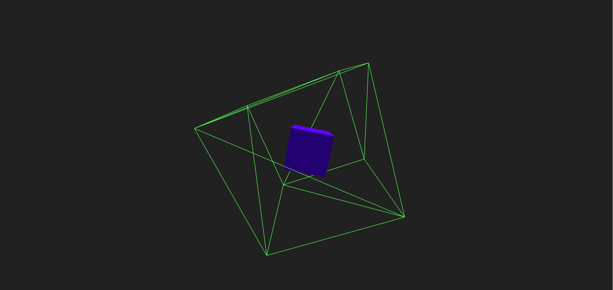

Exploring 3D Graphics with Three.js: A Basic Project
====================================================  

[Live Website](https://utkarshpathrabe.github.io/Basic-THREE.JS/)  

This basic Three.js project serves as an ideal starting point for individuals keen to dive into the captivating world of 3D graphics and web development. Designed primarily for educational purposes, this project introduces enthusiasts and learners to the fundamental concepts of Three.js, a popular 3D graphics library for JavaScript.

## ey Features and Highlights:

1. *Interactive 3D Graphics*: The project revolves around two main elements—a blue cuboid and a green cuboid skeleton. Both cuboids rotate, creating an engaging 3D visual effect. This interactivity fosters an immersive learning environment, allowing users to explore the principles of 3D animation.

2. *Opposite Rotations*: The blue cuboid and green cuboid skeleton rotate in opposite directions while sharing the same center position. This setup showcases the versatility of Three.js in manipulating and animating 3D objects, demonstrating how developers can control and synchronize object movements.

3. *Learning-Focused*: As a learning-oriented project, it provides hands-on experience in working with Three.js, which is valuable for anyone interested in web-based 3D graphics. It lays the foundation for more complex 3D modeling and interactive applications.

4. *Web-Based*: Being web-based, this project ensures accessibility to a broad audience. Users can interact with and analyze the rotating cuboids directly from their web browsers, making it an excellent resource for online education and experimentation.

5. *Expandable and Customizable*: While basic in nature, this project serves as a starting point for those who wish to explore and expand upon it. Developers can build upon this foundation to create more intricate 3D scenes and animations.

## Educational Significance:

This project aligns with the learning objectives of individuals seeking to grasp the fundamentals of 3D graphics and animation in a web development context. It demystifies the complexities of Three.js and serves as a stepping stone for those looking to venture into more advanced 3D modeling and interactive web applications. By offering an interactive and visually appealing experience, it makes learning about 3D graphics engaging and accessible.

In conclusion, this basic Three.js project stands as a testament to the educational potential of web-based 3D graphics. It empowers learners to grasp the core principles of Three.js while providing a foundation for further exploration and creativity in the realm of 3D web development. Whether you're a beginner or a seasoned developer seeking to expand your skill set, this project offers a valuable learning experience in the world of 3D graphics and animation.  

  
